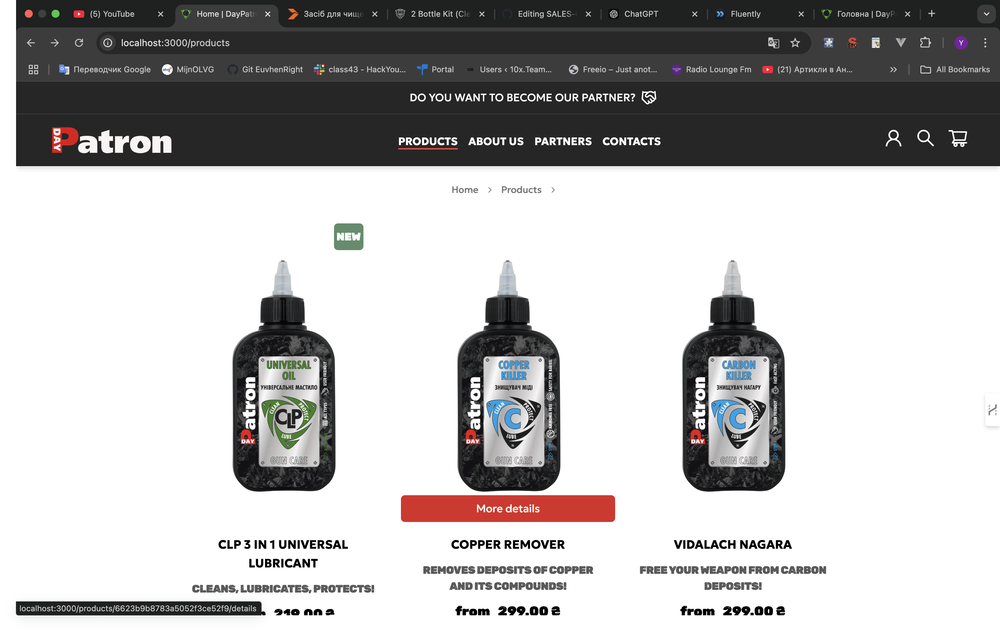
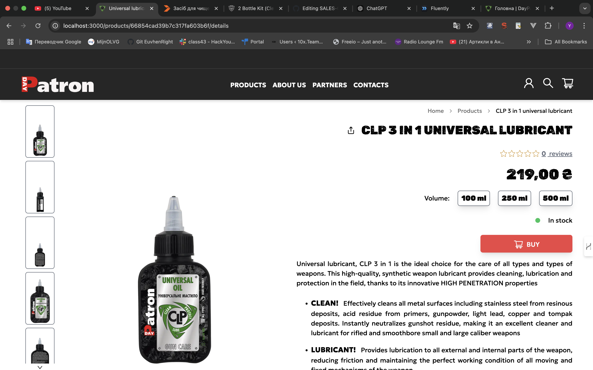
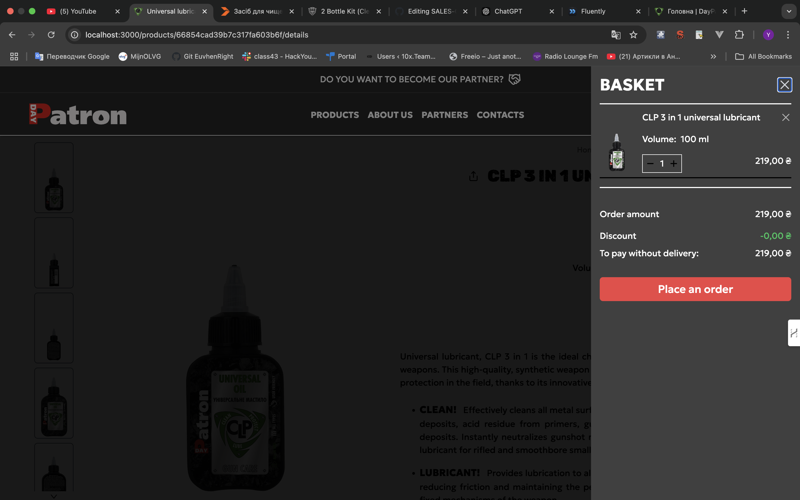
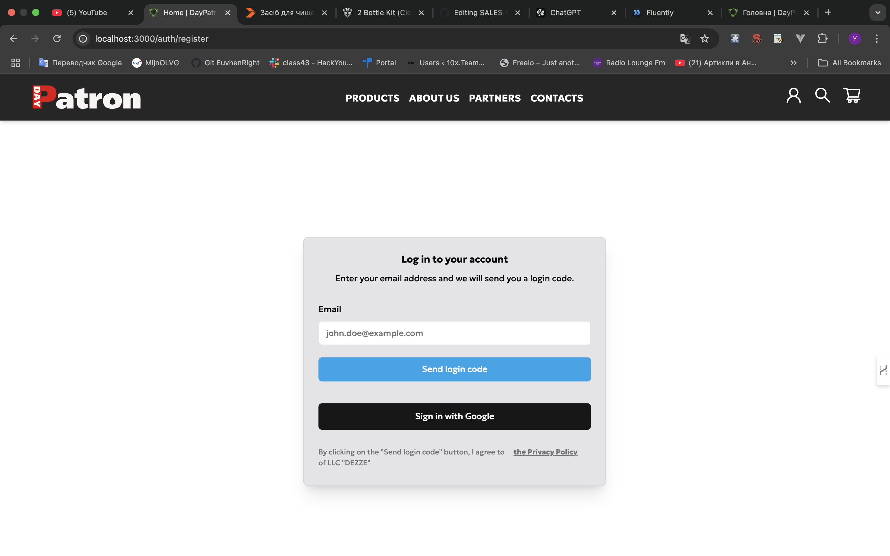
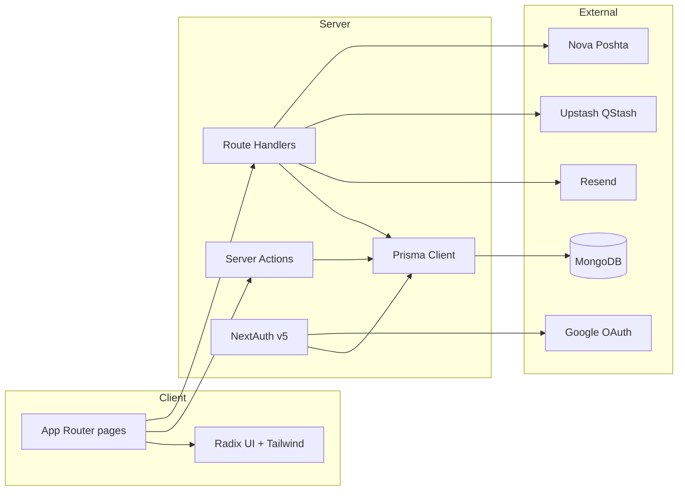

<div align="center">

# DayPatron

**An e-commerce storefront for the DayPatron wellness brand — catalog, cart, checkout, reviews, and email-OTP auth.**
*Built for a Ukrainian audience with Nova Poshta shipping and Ukrainian-language transactional email.*

[](https://day-patron-next.vercel.app/)
[](LICENSE)
[](https://nextjs.org)
[](https://www.typescriptlang.org)
[](https://tailwindcss.com)

<br/>

<a href="https://day-patron-next.vercel.app/"></a>

<sub>Passwordless email OTP · Server actions for cart and checkout · SSR + sitemap for SEO</sub>

</div>

---

## Overview

DayPatron sells wellness products directly through its own storefront. The site handles the full path from browsing a catalog to placing an order: product detail pages with variants and reviews, a persistent cart, address entry with Nova Poshta branch lookup, and order status tracking. Authentication is passwordless — the user submits an email and receives a one-time password valid for 15 minutes, after which Upstash QStash triggers the cleanup.

The app is a Next.js 14 App Router project talking to MongoDB via Prisma, with server actions handling cart and order mutations and a small set of route handlers covering auth, subscriptions, reviews, and third-party integrations. Solo project — TODO — confirm role and pro-bono/commercial context.

## Features

| | |
| :--- | :--- |
| **Product catalog** | Categories, variants (volume, article, price, stock), and per-product images sourced from Mongo. |
| **Cart & checkout** | Server-action-driven cart with bonus codes, discount totals, and postpaid or card payment options. |
| **Nova Poshta delivery** | Address form backed by a `/api/np` proxy for branch and city lookup. |
| **Reviews** | Paginated per-product reviews with ratings, verified flag, and rating totals kept on the product. |
| **Passwordless auth** | Email + one-time password (15 min TTL) via Resend, plus Google OAuth through NextAuth v5. |
| **Admin area** | Route group at `/admin` gated by role for order and content management. |
| **Transactional email** | Ukrainian-language templates for OTP delivery, subscription banners, and support replies. |
| **SEO** | `next-sitemap`, `robots.ts`, per-page metadata, and SSR of product pages. |

## Screenshots

| | |
| :--- | :--- |
| <a href="public/images/readme-img/Products.png"></a> | <a href="public/images/readme-img/Product.png"></a> |
| <a href="public/images/readme-img/Cart.png"></a> | <a href="public/images/readme-img/Registr.png"></a> |

## Tech Stack

**Framework:** Next.js 14.2 (App Router) · React 18.2 · TypeScript 5.3
**UI:** Tailwind CSS 3.4 · Radix UI primitives · shadcn/ui conventions · Framer Motion · Embla Carousel · Lucide
**Forms & validation:** react-hook-form · Zod · `@hookform/resolvers`
**Auth:** NextAuth v5 beta · `@auth/prisma-adapter` · Google OAuth · Credentials provider
**Data:** Prisma 5 · MongoDB
**Email & scheduling:** Resend · Upstash QStash · Upstash Workflow
**Integrations:** Google Maps JS API · Nova Poshta search proxy · Vercel Analytics
**Deployment:** Vercel · Dockerfile for self-hosting

## Architecture

The client renders through the App Router; mutations happen almost entirely through server actions in `actions/`, with `/api/*` route handlers reserved for callbacks and integrations that need explicit HTTP shape. NextAuth guards routes via `middleware.ts` against the `publicRoutes` and `authRoutes` tables in `routes.ts`. Password TTL enforcement is offloaded to QStash so the app itself never runs a cron.



### Key decisions

<details>
<summary><strong>Why passwordless OTP over a classic password field?</strong></summary>

A traditional password flow means hashing, rotation, reset emails, and lockout logic — all for a storefront where most users buy once or twice a year and forget any password they set. Emailing a 15-minute one-time code collapses signup and login into the same request, avoids storing a durable secret the user is likely to reuse elsewhere, and lets the same endpoint handle new and returning users. QStash then handles expiry by calling `/api/register/delete-password` on a delay, so no cron is needed inside the app.
</details>

<details>
<summary><strong>Why MongoDB via Prisma instead of a relational store?</strong></summary>

Products carry variable-shape data — multiple images, a list of volumes, an array of exclusive sizes — that maps naturally to a document model. Prisma still gives typed queries and migrations without the ergonomic cost of hand-writing Mongo queries, and the `@auth/prisma-adapter` slots into NextAuth without a custom adapter. The tradeoff is losing joins on order history; that's acceptable because the storefront queries orders per-user, never across.
</details>

## Project Structure

```text
.
├── app/                  # App Router — pages, layouts, route handlers
│   ├── admin/            # Role-gated admin area
│   ├── api/              # auth, login, register, reviews, subscription, feedback, np
│   ├── products/         # Catalog + product detail
│   ├── checkouts/        # Cart -> order flow
│   ├── dashboard/        # User profile, orders, addresses
│   └── ...               # about, contacts, guide, warranty, privacy, rules-reviews
├── actions/              # Server actions (cart, order, delivery, reviews, bonus, user)
├── components/           # Feature components + shadcn/ui in components/ui
├── lib/
│   ├── prisma.ts         # Singleton Prisma client
│   ├── db/               # Content JSON + Zod validation schemas
│   ├── services/         # Email templates, review helpers, constants
│   ├── hooks/            # Shared React hooks
│   ├── types/            # Shared TypeScript types
│   └── utils/            # Formatting, fonts
├── prisma/schema.prisma  # MongoDB models: User, Cart, Order, Product, Reviews, ...
├── public/               # Images, icons, videos
├── auth.ts               # NextAuth instance
├── auth.config.ts        # Providers (Google + Credentials)
├── middleware.ts         # Route guard against routes.ts
└── routes.ts             # publicRoutes / authRoutes / adminRoutes tables
```

## API

```http
POST /api/register
```

Send `{ email }`. Generates a 15-minute password, upserts the user, mails the code via Resend, and schedules deletion through QStash. Returns the user record.

```http
POST /api/login
```

Send `{ email, password }`. Returns the user on match, `401` on password mismatch, `404` if the account is unknown.

```http
POST /api/register/delete-password
```

QStash callback. Clears the temporary password once the 15-minute window elapses.

```http
GET /api/reviews?productId=<id>&page=<n>&pageSize=<n>
```

Paginated reviews for a product. `400` on missing or non-numeric page params.

```http
POST /api/subscription
```

Send `{ email }`. Creates or looks up a user, sends the marketing banner email, and sets a `bannerSeen` cookie.

```http
POST /api/feedback
```

Send `{ name, email, phone, message }`. Forwards the message to the support inbox via Resend.

```http
GET /api/np/[search]
```

Proxy for Nova Poshta branch and city lookup used by the delivery form.

`/api/auth/[...nextauth]` is the NextAuth handler; `/api/auth/error` renders auth errors.

## Deployment

Deployed to Vercel at [day-patron-next.vercel.app](https://day-patron-next.vercel.app/); `npm run build` runs `prisma generate` before `next build`. A `Dockerfile` is included for self-hosting.

## Security & Privacy

- **Known issue — plaintext passwords.** Both `auth.config.ts` and `app/api/login/route.ts` compare `user.password` to the submitted string directly. This is workable for the ephemeral 15-minute OTP flow but means credentials-provider passwords are never hashed at rest. Migrate to bcrypt/argon2 before any password becomes long-lived.
- Route protection lives in `middleware.ts`; anything outside `publicRoutes` redirects to `/auth/register`.
- OAuth secrets, database URL, Resend key, and QStash token are read from environment variables — none are committed.
- Admin routes are gated by the `Role` enum on the `User` model.
- No PII beyond email, name, phone, and delivery address is stored.

## Roadmap

**Done:** catalog, variants, cart, bonus codes, checkout with Nova Poshta, order events, paginated reviews, email OTP auth, Google OAuth, admin area, sitemap, Ukrainian transactional email.
**Next:** hash credential-provider passwords, add automated tests (none exist today), tighten Zod schemas on `/api/np`, English localization.
**Later:** card payment provider integration (currently `PAIMENTBYCARD` is a status only), abandoned-cart recovery via QStash, richer review moderation.

## FAQ

<details>
<summary><strong>Why is my one-time password only valid for 15 minutes?</strong></summary>

The 15-minute window is enforced by `passwordExpiresAt` on the user record and cleaned up by a QStash callback to `/api/register/delete-password`. It keeps the temporary credential short-lived so a leaked email doesn't grant indefinite access. Request a new code from the login page.
</details>

<details>
<summary><strong>Do I need an account to browse products?</strong></summary>

No. Everything listed in `publicRoutes` — home, catalog, product pages, about, contacts, warranty, guide, privacy, rules — renders without auth. An account is required to place an order or write a review.
</details>

<details>
<summary><strong>Can I write a review without registering?</strong></summary>

The reviews model requires a linked `userId` and marks entries as `verified`, so review submission runs behind auth. Reads (`GET /api/reviews`) are public and paginated.
</details>

## Acknowledgements

Built on [Next.js](https://nextjs.org) · [Prisma](https://www.prisma.io) · [NextAuth](https://authjs.dev) · [Radix UI](https://www.radix-ui.com) · [Tailwind CSS](https://tailwindcss.com) · [Resend](https://resend.com) · [Upstash](https://upstash.com) · [Nova Poshta](https://novaposhta.ua). Icons by [Lucide](https://lucide.dev).

## Author

Built by **EuvhenRight** — TODO — city and role/context (solo, pro bono, commercial).

**GitHub:** [@EuvhenRight](https://github.com/EuvhenRight) · **Email:** [ugnivenko.ea@gmail.com](mailto:ugnivenko.ea@gmail.com)

## License

[MIT](LICENSE) © EuvhenRight · built for the DayPatron wellness brand.
